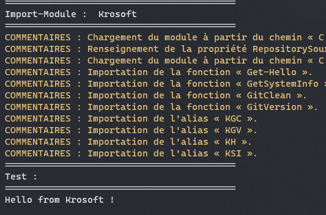

# Krosoft.Scripts

## PowerShell

Exécuter le script PowerShell 'install_krosoft.ps1' en tant qu'administrateur pour installer le module Krosoft.

Installatin du script réussie : une image vaut mille mots.

